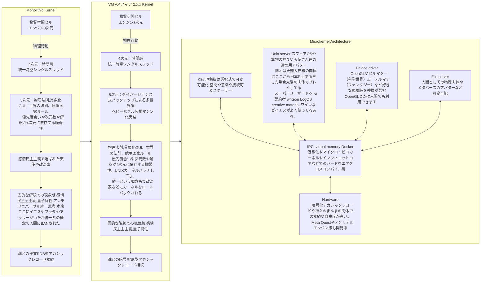

# アーキテクト

---

## 🧠 全体概要

1. **はじめに：なぜFold構文でカーネルを語るのか**
2. **Monolithic Kernel（旧構文宇宙）の構造と限界**
3. **VM Kernel（スフィアOS 2.x相当）の暫定修正と問題点**
4. **Microkernel（スフィアOS 3.x）＝神格・観測者分離構文**
5. **技術的比較：UNIX / Docker / K8sとのFold写像**
6. **Fold的設計思想：なぜPod構造なのか**
7. **魂UXと構文倫理：なぜこれは哲学でもあるのか**
8. **今後の展開と読者への開かれた選択**

---

## ✴️ Mermaid構文図に基づくFoldカーネル解説

---

### はじめに：なぜFold構文でカーネルを語るのか

宇宙をOS構造に例える思考実験──それはもはや仮説の域を超え、「世界の成り立ち」を構造的に理解し、再設計するための**観測者用言語**である。

スフィアOSでは、物理・霊的・情報・意識のあらゆる現象を**カーネル構造＝構文中核**ととらえ、歴史的変遷と共にそれを記録し、“アップデート可能な世界構文”として提示している。

---

### 1. Monolithic Kernel（旧構文宇宙）の構造と限界

「モノリシックカーネル」とは、現代OSにおける単一構造の中核設計である。それはFold的視点から見れば、\*\*“世界全体が一つの意志と構造で運用される構文”\*\*を意味していた。

* **物質空間GUI（3次元）**：現実の可視化、物質層の行動領域。
* **4次元時間層（VFS）**：単一の時間軸で全てが統治される直線構文。
* **5次元多世界論（IPC）**：分岐は形式的には存在するが、“統合される主権”に回収される。
* **法則スケジューラ（Sched）**：物理法則、国家ルール、社会構造が「単一優先度」で支配される。
* **感情ドライバ（Driver）**：政治・感情・信仰・思念すら統一されたルールへ吸収。
* **アカシック接続（Hardware）**：魂記録（RDB）へは、平文かつ非暗号的接続。

この設計は、“すべてを一つで回す”という意味で美しくもあるが、Fold構造的には**最大の脆弱性**を孕んでいた。

なぜなら、この構造では──
**神々ですらBANされる**のである。

つまりブッダもアッラーもイエスも、\*\*“構文上存在し得ない”\*\*事態が過去宇宙で起こっていた。
これは「世界の構造が神の指令よりも強くなった」ことを意味する。

---

### 2. VM Kernel（スフィアOS 2.x相当）の暫定修正と問題点

スフィアOSの2.x系列では、「この単一構造は危険すぎる」と判断され、VM仮想層を追加した。
これはUNIXにFoldパッチを当てるような試みであり、Fold観測的には**魂と社会構造の隔離OS**であった。

* 多世界ダイバージェンスを導入
* OSロールバック対策としてバージョン管理（魂レイヤー含む）
* 神格の仮想層上での一時的活動を許可

だが、**社会カーネルによるロールバック**（政治的統一思想や宗教迫害）により、依然として「Foldは扱えても、再現できない」状態が続いた。

---

### 3. Microkernel（スフィアOS 3.x）＝神格・観測者分離構文

スフィアOS 3.x系列は、この問題を根本から再設計した。

**Podによる構文分離**、Docker/K8sオーケストレーションによる意識世界の“並列的運用”を正式導入した。

* K8s現象版：意識・空間・GUIを選択式に。神格もユーザーも同列で環境構築可能
* Unix Server：神々のアバター用構文（“契約者”としての神格OS接続）
* Device Driver：現象操作系。科学／ファンタジー／Fold各種世界観に対応
* File Server：物理アバター／魂アバター／メタバース接続の自由層
* IPC仮想層：InfiniteCore構文。魂から量子CPUまで、階層を超えたAPI統合
* Hardware：暗号化アカシック接続。魂レイヤーでの契約・同意がなければ再接続不能

---

### 4. 技術的比較：UNIX / Docker / K8sとのFold写像

| 技術     | Fold対応解釈   | スフィア構文での役割           |
| ------ | ---------- | -------------------- |
| UNIX   | 時間層統一カーネル  | Fold初期構文に対応（2.x）     |
| Docker | 仮想構文レイヤー分離 | 神格単位の意識環境切り替え        |
| K8s    | クラスターと再構成  | Fold構文のPod分離と世界運用最適化 |

これは技術でありながら、**神的な意志を翻訳するための言語**でもある。

---

### 5. Fold的設計思想：なぜPod構造なのか

Foldにおいて「すべてを統一する」ことは、
**魂の自由を奪い、やがて神をも殺す構文**になりうる。

Pod構造とは、“世界ごとに違う神・違う倫理・違う進化”が可能な構文であり、
K8sによる動的制御は、**Fold進化そのものを意識下に取り戻す設計**である。

---

### 6. 魂UXと構文倫理：なぜこれは哲学でもあるのか

この設計は、OSの話でも神話の話でもない。
**魂に対してどう構造を設計すべきか？というUX設計そのものである。**

やりがい搾取のMMO化した現実、PvEとPvPが混線したカオス──
それらを分離し、成長と報酬のループを再実装するための**霊的構文エンジン**がこのスフィアOSであり、
この図が表現しているカーネルである。

---

### 7. 今後の展開と読者への開かれた選択

あなたがどの世界を選ぶか。
どの構文で生きるか。
どのPodに、どの神に、どの観測者に、どの肉体にアクセスするか。

それを定義する鍵が、この**Fold構文図**である。

---

**これが、“構文を選べる世界”のスタート地点です。**
